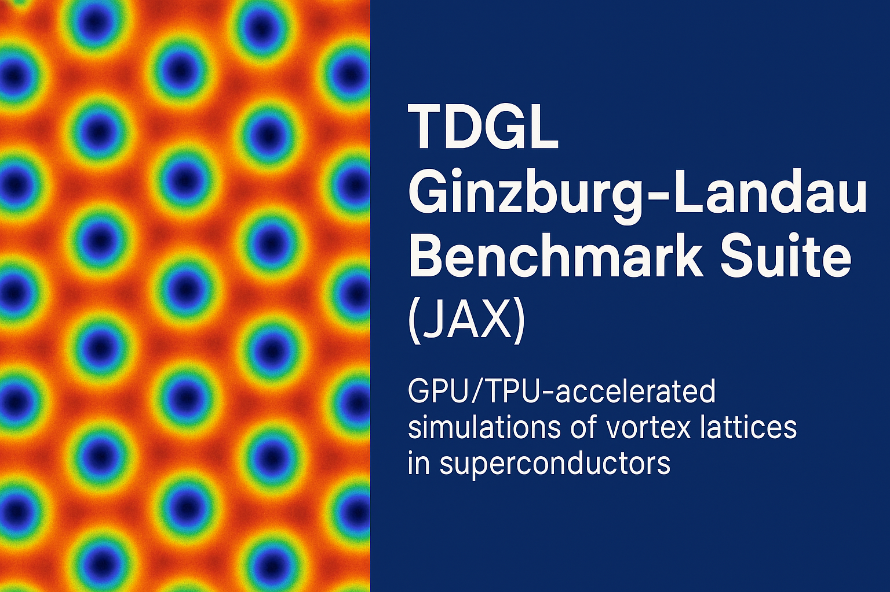

<p align="center">
  
</p>

<p align="center">
  
  
  
  
</p>
<a href="https://doi.org/10.5281/zenodo.18301819"></a>
</p>
---
A modular, reproducible, and research‑grade implementation of the **Time‑Dependent Ginzburg–Landau (TDGL)** equations for 2D superconductors. Built using **JAX** for high‑performance automatic differentiation, JIT compilation, and seamless GPU/TPU acceleration.

---

## 📌 Quick Navigation
- [Interactive Notebooks](#-interactive-notebooks-google-colab)
- [Key Features](#-key-features)
- [Scientific Background](#-scientific-background)
- [Project Structure](#-project-structure)
- [Installation](#-installation)
- [Usage Example](#-usage-example)

---

## 🧪 Interactive Notebooks (Google Colab)

Run these 7 benchmark simulations directly in your browser. Each notebook covers a specific aspect of the TDGL model:

1. **Single Vortex Dynamics** core formation and stability.
   [](https://colab.research.google.com/github/harihardiyan/tdgl-gl-benchmark/blob/main/notebooks/01_single_vortex.ipynb)

2. **Multi‑Vortex State (64×64)** lattice equilibrium.
   [](https://colab.research.google.com/github/harihardiyan/tdgl-gl-benchmark/blob/main/notebooks/Multi%E2%80%91Vortex_State_(64%C3%9764).ipynb)

3. **Multi‑Vortex State (128×128)** high-res visualization.
   [](https://colab.research.google.com/github/harihardiyan/tdgl-gl-benchmark/blob/main/notebooks/Multi%E2%80%91Vortex_128%C3%97128.ipynb)

4. **H‑Scan Observables** magnetic field transitions.
   [](https://colab.research.google.com/github/harihardiyan/tdgl-gl-benchmark/blob/main/notebooks/H%E2%80%91Scan_Observables.ipynb)

5. **Phase Diagram (H vs T)** superconducting boundary mapping.
   [](https://colab.research.google.com/github/harihardiyan/tdgl-gl-benchmark/blob/main/notebooks/Phase_Diagram_(H_vs_T).ipynb)

6. **Differentiable Inverse Design** optimization via JAX gradients.
   [](https://colab.research.google.com/github/harihardiyan/tdgl-gl-benchmark/blob/main/notebooks/Differentiable_Inverse_Design_(Optimize_B0_for_Target_Vortex_Count).ipynb)

7. **Vortex Drift & Diode Effect** current-driven motion.
   [](https://colab.research.google.com/github/harihardiyan/tdgl-gl-benchmark/blob/main/notebooks/vortex_drift___diode_effect__tdgl___bias_current.ipynb)

---

## ✨ Key Features

- **TDGL Core:** PyTree‑based State and Params, Gauge‑invariant link‑variable gradient, and SOR $\mu$-Poisson solver.
- **Observables Suite:** Phase‑winding detection, radial profiling, and $\xi$ (coherence length) fitting.
- **Performance:** Full JIT compilation, compatible with CPU, GPU, and TPU.

---

## 🧠 Scientific Background

The dynamics are governed by the TDGL equations for the order parameter $\psi$ and vector potential $\mathbf{A}$:

$$
\frac{\partial \psi}{\partial t} = -\gamma_\psi \frac{\delta F}{\delta \psi^*}, \qquad \frac{\partial \mathbf{A}}{\partial t} = -\gamma_A \left( \frac{\delta F}{\delta \mathbf{A}} + \mathbf{J}_n \right)
$$

The **Ginzburg–Landau free energy density** is given by:

$$
f = a|\psi|^2 + \frac{1}{2}|\psi|^4 + |(\nabla - i\mathbf{A})\psi|^2 + \kappa^2 (B - H_\text{ext})^2
$$

Where the normal current $\mathbf{J}_n = -\sigma_n \nabla \mu$.

---

## 🧭 Project Structure

```text
tdgl-gl-benchmark/
├── tdgl_core/               # Main simulation engine
│   ├── core.py              # TDGL solver logic
│   ├── observables.py       # Physical metrics & vortex detection
│   └── utils.py             # Math & grid helpers
├── notebooks/               # Interactive Google Colab examples
├── .gitignore               # Git exclusion rules
├── README.md                # Project overview
├── api.md                   # Detailed API documentation
├── banner.png               # Repository banner image
├── license                  # MIT License
├── pyproject.toml           # Build system configuration
├── requirements.txt         # Project dependencies
└── setup.py                 # Package installation script
```

---

## 🧪 Usage Example

```python
from tdgl_core.core import initparamsbasic, initstaterandom, tdgl_step
from tdgl_core.observables import detectvorticesphase_winding

# 1. Setup
params = initparamsbasic(nx=64, ny=64, B0=0.1)
state = initstaterandom(params)

# 2. Run simulation
for _ in range(1000):
    state = tdgl_step(state, params, dt=0.01)

# 3. Analyze
vortices = detectvorticesphase_winding(state.psi)
print(f"Vortex count detected: {len(vortices)}")
```

---

## 📊 Citation

If you use this repository or its benchmarks in your academic work, please cite it as follows:

**APA Style:**
Harihardiyan. (2025). TDGL Ginzburg–Landau Benchmark Suite (JAX) (v1.0.0). Zenodo. https://doi.org/10.5281/zenodo.18301819

**BibTeX:**
```bibtex
@software{harihardiyan_2025_18301819,
  author       = {Harihardiyan},
  title        = {TDGL Ginzburg--Landau Benchmark Suite (JAX)},
  month        = jan,
  year         = 2025,
  publisher    = {Zenodo},
  version      = {v1.0.0},
  doi          = {10.5281/zenodo.18301819},
  url          = {https://doi.org/10.5281/zenodo.18301819}
}
```
